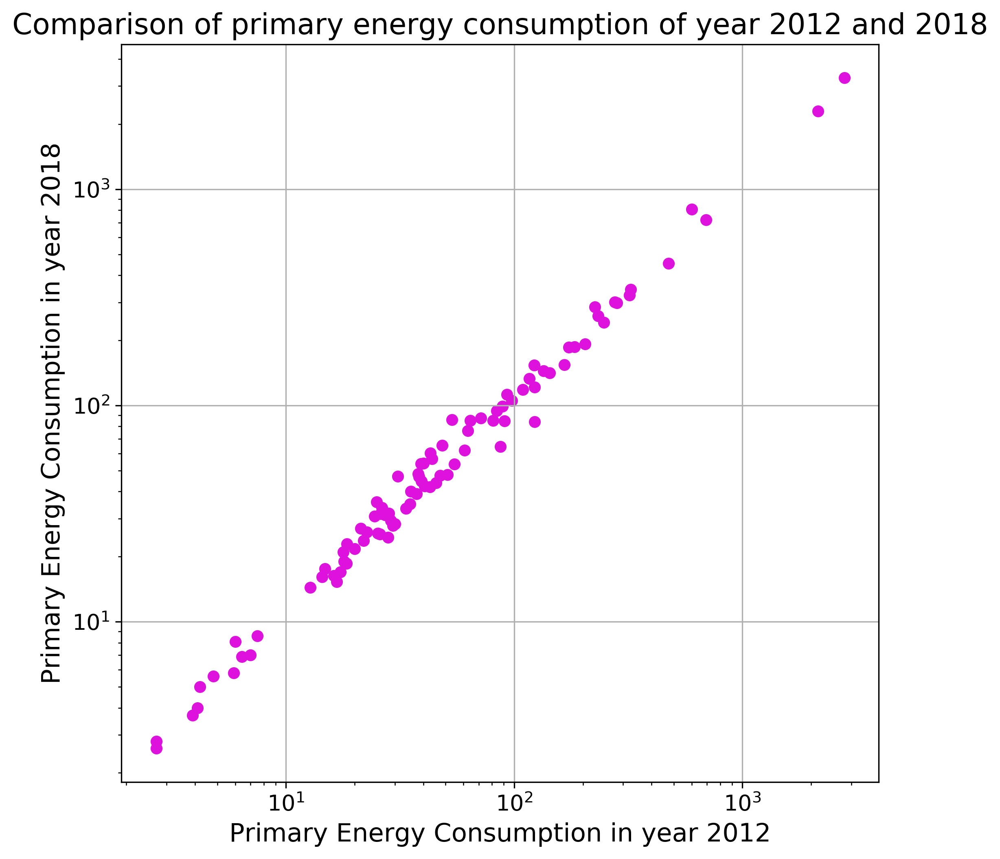
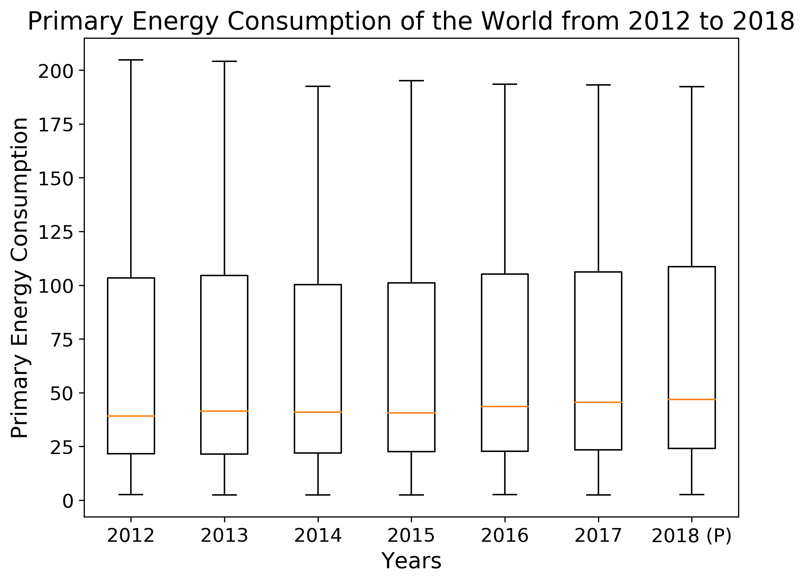
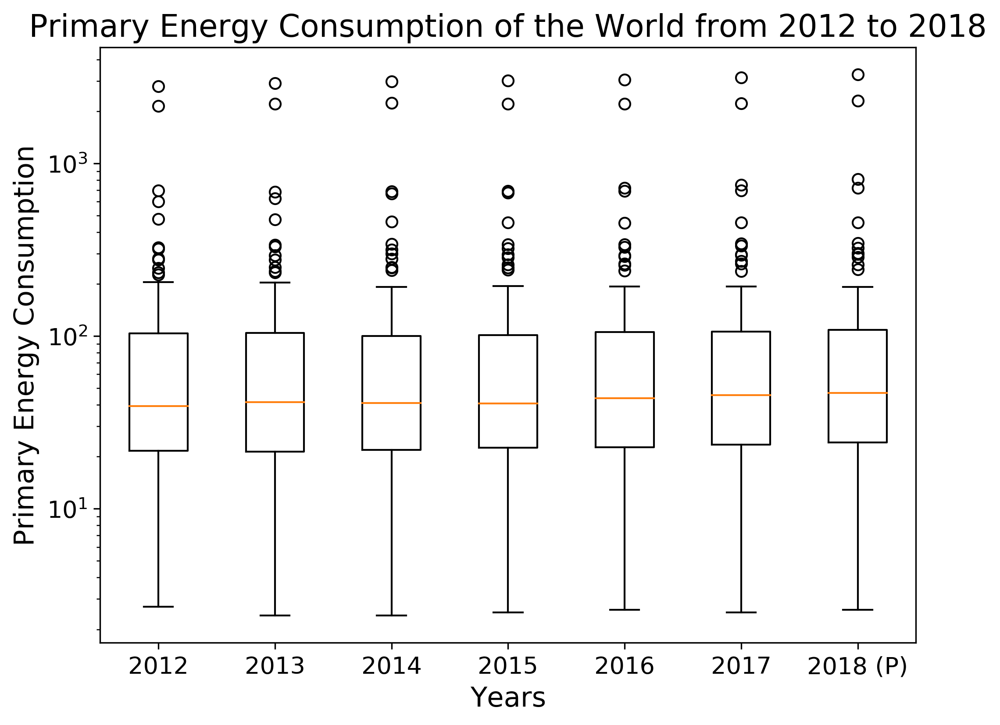
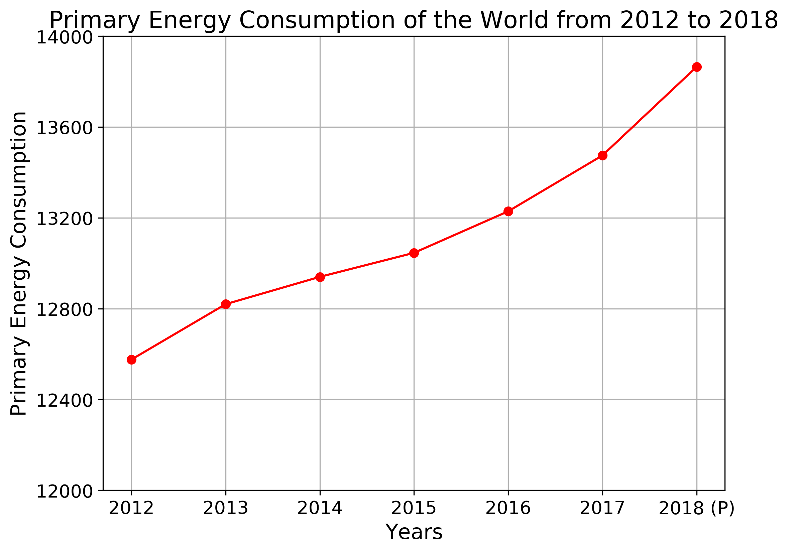

# DS200:Research Methods
* * *
## Module 4 : Assignment
* * *

> **Aim of this assignment is to explore one of datasets in data.gov.in and plot in matplotlib**

###  Dataset
> The dataset is <a href="#my_anchor">[1]</a> **Primary Energy Consumption in Select Countries of the World from 2012 to 2018** and is  downloaded from [here](https://data.gov.in/resources/primary-energy-consumption-in-select-countries-of-the-world-from-2012-).
>> The data is released under ** National Data Sharing and Accessibility Policy (NDSAP)** 

###  Files

1.  There are folders named as 'data' and 'plots' inside ZIP file. Along with these, python script, 'DS200Plots.py' is also there.
2.  'data' folder contains the data file, 'primaryEnergy.xls'. And all the plots are saved in 'plots' folder
3.  Along with these, I am also uploading the jupyter notebook, 'DS200Plots.ipynb'  

###  Plots
#### (a) Scatter plot

1. In this scatter plot, we did comparison of primary energy consumption between year 2012 and 2018.
2. Each data point represent energy consumption by different country. There are 99 data points in total.
3. From this we can say trend is almost same for both years. Few countries are consuming high amount of energy in both years. 
* * *

#### (b) Box Plot

1. Here I plotted box-plot for primary energy consumption for each year from 2012 till 2018.
2. I have plotted two box-plots, first one is on linear scale without outliers and second one on log scale with the outliers.
3. One can observe decrease in maximum values after year 2013 in linear scale plot. But median is increasing as we go to year 2018.

* * *
### Part3: - Lineplot

1. In this lineplot, we have plotted primary energy consumption of whole world from the the year 2012 to 2018.
2. Units on Y-axis is in Million Tonnes Oil Equivalent.
3. From this we can see that Energy demand is increasing consistently over the last years and after year 2015, there is increase in slop also. 

## References
<b id="my_anchor">[1].</b> Primary Energy Consumption in Select Countries of the World from 2012 to 2018, [https://data.gov.in/resources/primary-energy-consumption-in-select-countries-of-the-world-from-2012-](https://data.gov.in/resources/primary-energy-consumption-in-select-countries-of-the-world-from-2012-).

